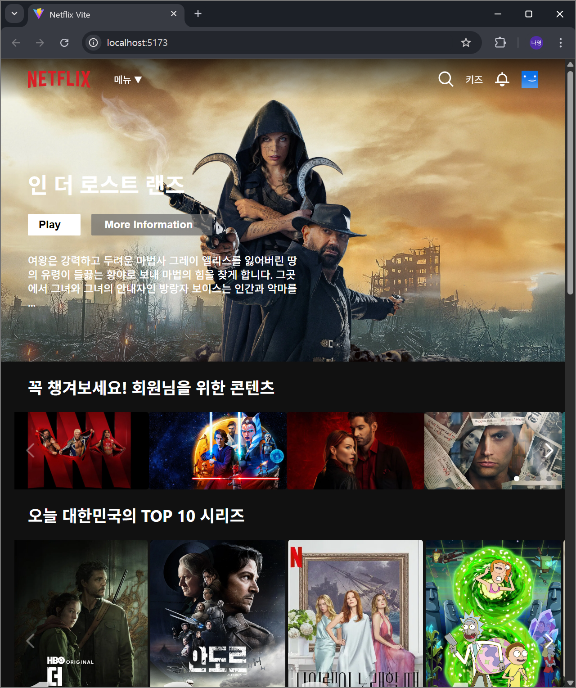
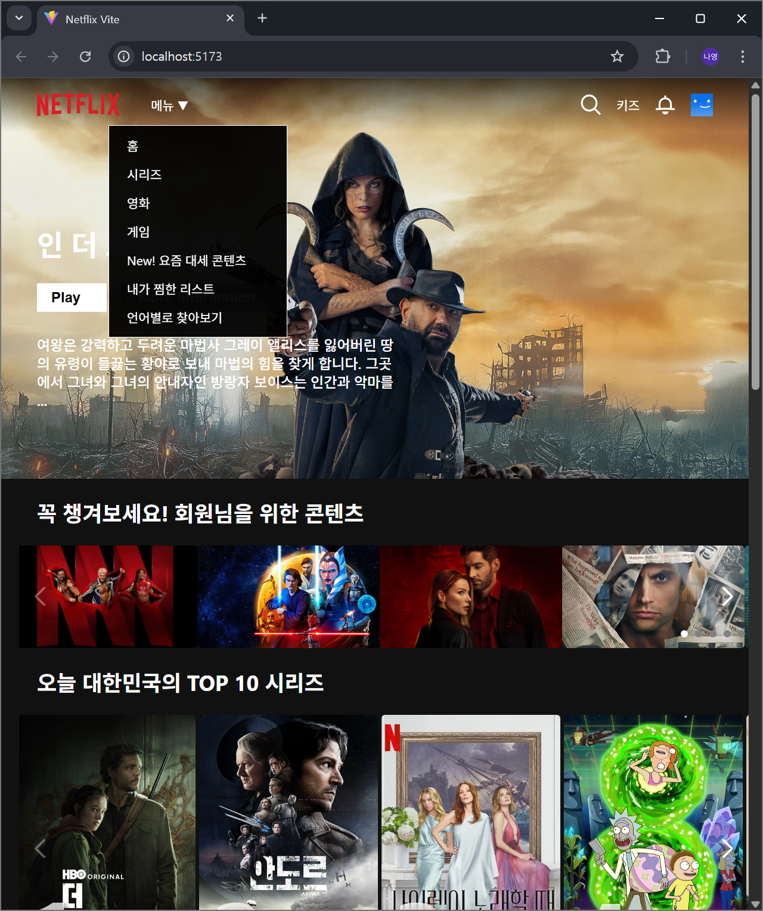
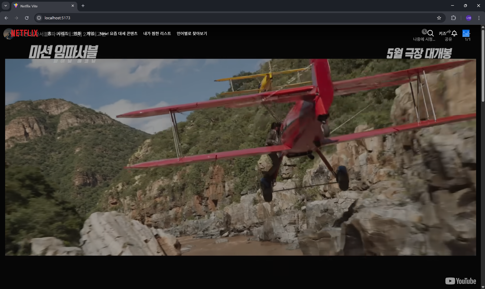
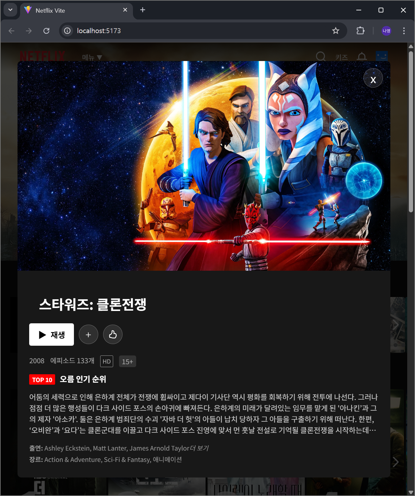
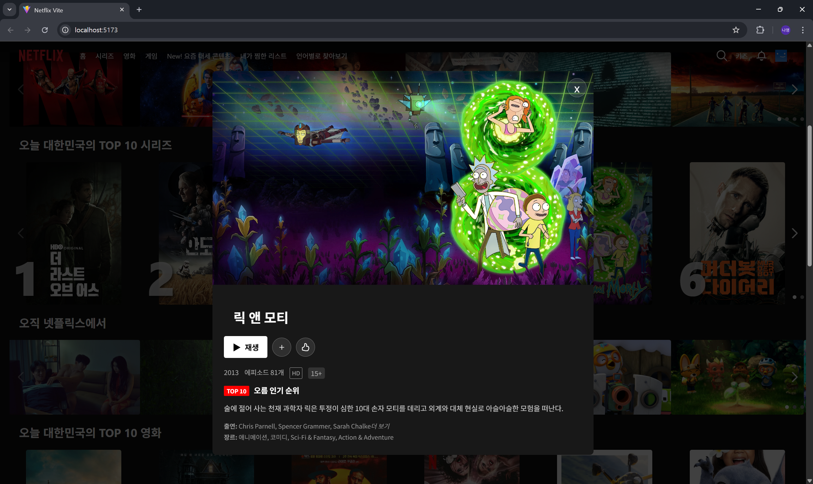
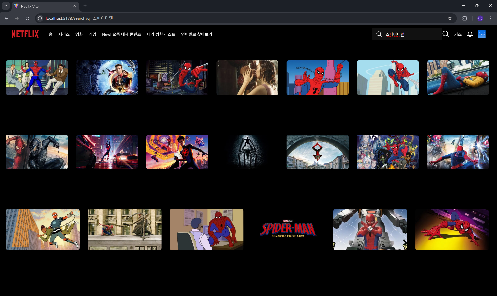
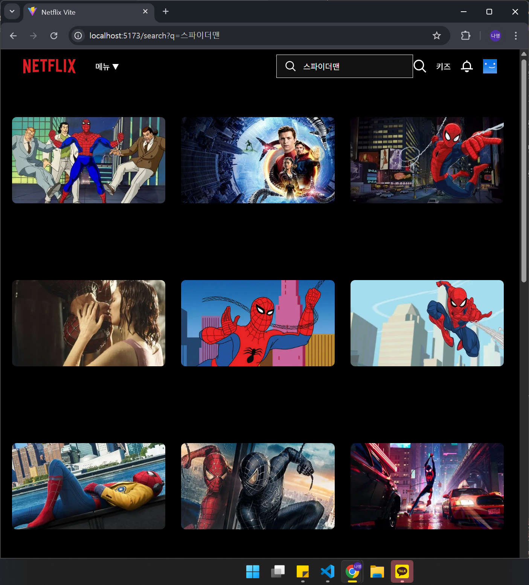

# EXP-MISSION-Netflix

TMDB API를 활용하여 제작한 Netflix 클론 프로젝트입니다.  
실제 넷플릭스처럼 슬라이더, 검색, 상세 정보 모달, 반응형 UI를 제공하며, 사용자 중심의 기능을 구현했습니다.

---

### 사용 기술

| 분류         | 기술                      |
| ------------ | ------------------------- |
| **Frontend** | React, Vite               |
| **Styling**  | CSS Modules               |
| **API**      | TMDB (The Movie Database) |
| **Router**   | React Router DOM          |
| **Slider**   | Swiper.js                 |

---

### 구현 기능

| 기능                  | 설명                                                                                            |
| --------------------- | ----------------------------------------------------------------------------------------------- |
| **배너**              | 현재 상영 중 영화 중 하나를 랜덤으로 선택하여 배경 표시 및 Play 버튼 클릭 시 유튜브 예고편 재생 |
| **검색 기능**         | 영화, 시리즈 통합 검색 + 디바운스 적용으로 API 호출 최소화                                      |
| **Row 슬라이더**      | 다양한 장르/카테고리별 영화 리스트를 Swiper로 구성 (TOP10, 넷플릭스 오리지널, 호러 등)          |
| **모달 상세 정보**    | 포스터 클릭 시 등장인물, 장르, 출시일, 설명 등의 상세 정보 표시                                 |
| **반응형 네비게이션** | 모바일 및 데스크탑에서 모두 대응 가능한 메뉴 및 검색창 UI                                       |
| **사용자 맞춤 추천**  | "회원님을 위한 콘텐츠"로 개인화된 카테고리 시뮬레이션                                           |

---

### 화면

> 전체화면

<table> 
  <tr> 
    <td></td> 
    <td></td>  
    
  </tr> 
  <tr>
  <td></td> 
  <td></td>
  </tr>
</table>

> 반응형 화면

<table> 
  <tr> 
    <td></td> 
    <td></td>  
  </tr> 
</table>

> 배너 클릭시

<table> 
  <tr> 
    <td></td>   
  </tr> 
</table>

> 포스터 클릭시 상세정보 모달창

<table> 
  <tr> 
    <td></td> 
    <td></td>  
  </tr> 
</table>

> 검색기능

<table> 
  <tr> 
    <td></td> 
    <td></td>  
  </tr>

  <tr>
  <td></td> 
  <td></td>
  </tr>
</table>

---

### 폴더 구조

```bash
📦 src
├── api/
│   ├── axios.js            # TMDB axios 인스턴스 설정
│   └── requests.js         # 영화 카테고리 API 경로 모음
│
├── assets/                 # 아이콘 및 이미지
│
├── components/
│   ├── Banner/             # 메인 배너 컴포넌트
│   ├── MovieModal/         # 영화 상세정보 모달
│   ├── Nav/                # 상단 내비게이션 바
│   └── Row/                # 슬라이더 UI
│
├── hooks/
│   ├── useDebounce.js      # 입력 디바운스 처리
│   └── useOnClickOutside.js # 외부 클릭 감지 훅
│
├── pages/
│   ├── Home/               # 메인 홈 페이지
│   └── Search/             # 검색 결과 페이지
│
├── App.jsx                 # 라우터 설정
├── main.jsx                # 앱 진입점
└── index.css               # 전역 스타일
```
