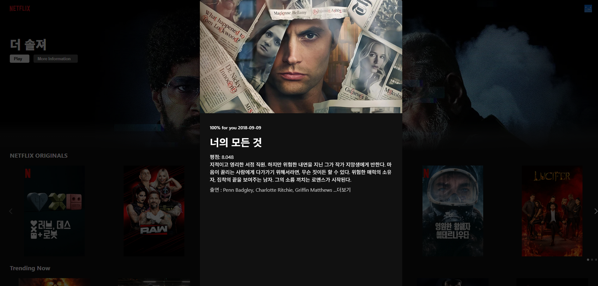
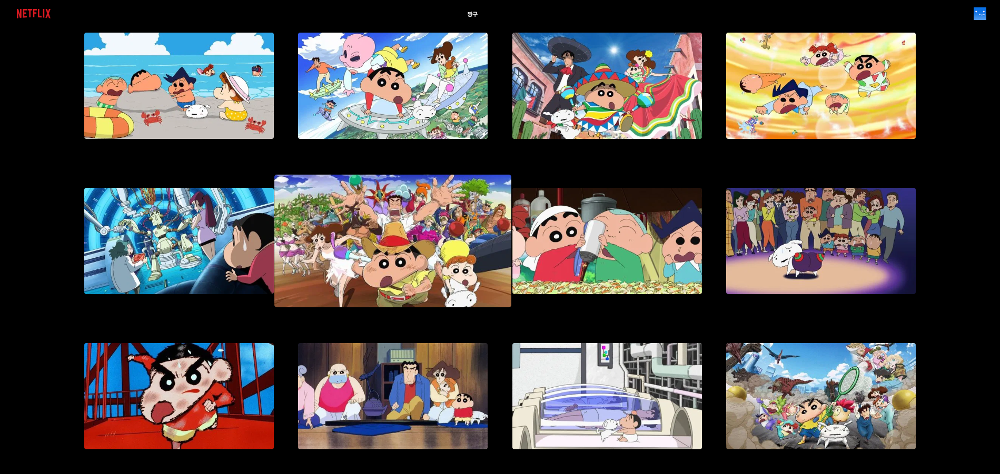

# EXP-MISSION-Netflix

## 사용 기술
- React
- React Router Dom
- Axios
- swiper
- styled-components

## 구현 기능
- 상세정보 모달 구현
- 검색 기능 구현
- API를 활용한 콘텐츠 데이터 가져오기
- 메인 페이지 카페고리별 구현
- 반응형 구현

## 화면
### 메인 페이지

### 반응형

### 상세정보 모달

### 검색

### 자세히 보기

## 파일 구조
- api -> API를 활용한 콘텐츠 데이터 가져오기
  - axios -> TMDB API 요청을 위한 axios 인스턴스를 설정 구현
  - requests.js -> 각종 콘텐츠 카테고리에 대한 API 요청 endpoint들을 정리한 객체 구현
- components
  - MovieModel -> 상세정보 모달 구현
  - Row -> 카페고리별 구현
  - Banner -> 메인 페이지 배너 구현
  - Nav -> 상단 구현
  - Footer -> 하단 구현
- pages
  - MainPage -> 메인 페이지
  - DetailPage -> 자세히 보기 페이지
  - SearchPage -> 검색 페이지
- hooks
  - useDebounce -> 검색에 따른 실시간 결과 구현
  - useOnClickOutside -> 모달 구현
- app.js -> 전체 앱의 UI 구조와 라우팅 경로를 정의하는 루트 컴포넌트 구현
- index.js -> React 앱의 진입점으로, App 컴포넌트를 BrowserRouter와 함께 DOM에 렌더링 구현
